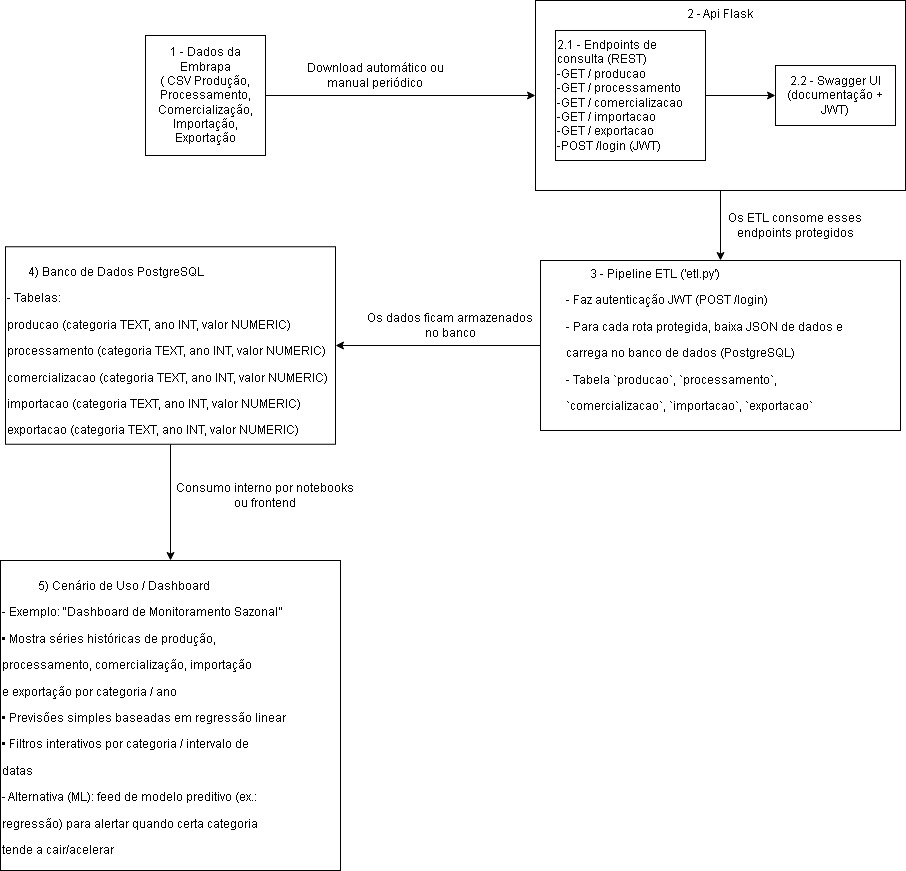

# API Vitivinicultura Embrapa

Este repositório contém a implementação de uma API REST em Python (Flask) para consulta aos dados de vitivinicultura da Embrapa, protegida por JWT e documentada via Swagger. Inclui também o plano arquitetural (diagrama) que mostra como esses dados podem ser consumidos por futuras aplicações ou dashboards.

---

## Índice

1. [Arquitetura do Projeto](#arquitetura-do-projeto)  
2. [Pré-requisitos](#pré-requisitos)  
3. [Configuração do Ambiente Local](#configuração-do-ambiente-local)  
4. [Variáveis de Ambiente](#variáveis-de-ambiente)  
5. [Execução da API Flask](#execução-da-api-flask)  
   1. [Instalar Dependências](#51-instalar-dependências)  
   2. [Executar Localmente](#52-executar-localmente)  
   3. [Autenticação (JWT)](#53-autenticação-jwt)  
   4. [Swagger UI](#54-swagger-ui)  
6. [Plano de Arquitetura e Deploy](#plano-de-arquitetura-e-deploy)  
   1. [Descrição de Componentes (Resumo)](#61-descrição-de-componentes-resumo)  
   2. [Cenário de Uso / Dashboard](#62-cenário-de-uso--dashboard)  
   3. [Deploy no Railway (etapas rápidas)](#63-deploy-no-railway-etapas-rápidas)  
   4. [Link Compartilhável da API](#64-link-compartilhável-da-api)  
7. [Estrutura do Projeto](#estrutura-do-projeto)  

---

## Arquitetura do Projeto

A seguir, o diagrama ilustra o fluxo completo, desde a obtenção dos dados até o cenário de uso final:



### Descrição de cada bloco

1. **Fontes da Embrapa (CSV)**  
   - As abas “Produção”, “Processamento”, “Comercialização”, “Importação” e “Exportação” disponibilizam arquivos CSV que podem ser baixados manualmente ou via script agendado.  

2. **API Flask**  
   - Endpoints REST:  
     - `POST /login` → emissão de JWT  
     - `GET /producao`  
     - `GET /processamento`  
     - `GET /comercializacao`  
     - `GET /importacao`  
     - `GET /exportacao`  
   - Cada rota baixa o CSV correspondente, processa e retorna JSON no formato longo (`categoria`, `ano`, `valor`).  
   - Documentação via Swagger UI em `/apidocs` e embutida em `/documentacao`.  

3. **Banco de Dados PostgreSQL (opcional)**  
   - Caso seja necessário armazenar histórico, crie tabelas:  
     ```sql
     CREATE TABLE producao (
       categoria TEXT,
       ano       INT,
       valor     NUMERIC
     );
     ```
     (idem para processamento, comercializacao, importacao, exportacao)  
   - Esses dados podem ser consumidos por notebooks ou dashboards.  

4. **Pipeline de ETL (opcional)**  
   - Job agendado (cron, GitHub Actions) que:  
     1. Baixa CSVs da Embrapa (ou consome API)  
     2. Normaliza e valida  
     3. Carrega o banco de dados  

5. **Serviço de Inferência / ML (hipótese)**  
   - Exemplo de rota futura: `POST /prever-producao`  
   - Recebe `{ "categoria": "VINHO DE MESA", "ano_referencia": 2023 }`  
   - Retorna `{ "ano_previsto": 2024, "prev_valor": 180000000 }`  
   - Modelo treinado em Python consumindo o histórico do banco.  

6. **Deploy no Railway**  
   - Repositório GitHub conectado ao Railway.  
   - `requirements.txt` define dependências.  
   - Start Command: `python app.py`.  
   - Variáveis de ambiente configuradas (p. ex. `JWT_SECRET_KEY`).  
   - Domínio público gerado:  
     ```
     https://tech-challenger-vitivinicultura-production.up.railway.app
     ```

---

## Pré-requisitos

- Python 3.13+  
- pip (>= 21)  
- (Opcional) PostgreSQL local ou em nuvem, se desejar persistir dados  
- (Opcional) Railway CLI ou acesso ao painel do Railway  

---

## Configuração do Ambiente Local

1. Clone este repositório:  
   ```bash
   git clone https://github.com/PVAdvolveAi/tech-challenger-vitivinicultura.git
   cd tech-challenger-vitivinicultura
Crie e ative um ambiente virtual:

Linux/Mac

bash
Copiar
Editar
python3 -m venv venv
source venv/bin/activate
Windows (PowerShell)

powershell
Copiar
Editar
python -m venv venv
.\venv\Scripts\Activate.ps1
Instale as dependências:

bash
Copiar
Editar
pip install --upgrade pip
pip install -r requirements.txt
Variáveis de Ambiente
Defina no terminal a chave para JWT antes de rodar a API:

Linux/Mac

bash
Copiar
Editar
export JWT_SECRET_KEY="uma_chave_super_secreta"
Windows (PowerShell)

powershell
Copiar
Editar
$env:JWT_SECRET_KEY = "uma_chave_super_secreta"
Execução da API Flask
5.1. Instalar Dependências Específicas
Caso deseje instalar manualmente apenas o essencial:

bash
Copiar
Editar
pip install flask flasgger flask-jwt-extended requests pandas beautifulsoup4
5.2. Executar Localmente
Garanta que JWT_SECRET_KEY esteja definido no ambiente.

Inicie o servidor:

bash
Copiar
Editar
python app.py
A API ficará disponível em

cpp
Copiar
Editar
http://127.0.0.1:5000
5.3. Autenticação (JWT)
POST /login

Content-Type: application/json

Body:

json
Copiar
Editar
{
  "username": "admin",
  "password": "senha123"
}
Resposta:

json
Copiar
Editar
{
  "access_token": "<seu_token_JWT>"
}
Utilize o token retornado no header Authorization: Bearer <token> para acessar as rotas protegidas.

5.4. Swagger UI
Acesse no navegador:

arduino
Copiar
Editar
http://127.0.0.1:5000/documentacao
Clique em Authorize e cole Bearer <seu_token_JWT>.

Use “Try it out” para testar endpoints:

GET /producao

GET /processamento

GET /comercializacao

GET /importacao

GET /exportacao

Plano de Arquitetura e Deploy
6.1. Descrição de Componentes (Resumo)
Fontes da Embrapa (CSV)
– Download manual ou via script agendado.

API Flask (REST + JWT + Swagger)
– Endpoints para cada aba,
– Documentação em Swagger.

Banco de Dados PostgreSQL (Não implementado)
– Tabelas para historizar cada aba.

Pipeline ETL (Não implementado)
– Job agendado que ingere CSVs e popula o banco.

Serviço de Inferência / ML (Hipotético)
– Endpoint de previsão consumindo modelo treinado.

Deploy no Railway
– Build automático via requirements.txt,
– Start: python app.py,
– Variáveis: JWT_SECRET_KEY,
– Domínio público gerado.

6.2. Cenário de Uso / Dashboard
“Dashboard de Monitoramento Sazonal”:

O frontend (React, Streamlit etc.) faz chamadas à API para obter séries históricas.

Exibe gráficos interativos (filtros por ano, categoria).

Mostra indicadores (média móvel, variação percentual).

Em futuro, pode chamar o endpoint de previsão para exibir tendências.

6.3. Deploy no Railway (Etapas Rápidas)
No painel do Railway, crie um novo projeto a partir do repositório GitHub.

Certifique-se de que requirements.txt contenha todas as bibliotecas.

Defina a variável de ambiente JWT_SECRET_KEY.

Em “Settings → Networking”, clique em Generate Domain (se ainda não tiver domínio).

Em “Settings → Build & Deploy”, verifique que o comando de start seja:

nginx
Copiar
Editar
python app.py
Deploy automático ocorrerá ao dar push em main.

Aguarde “Succeeded” e copie o domínio gerado, que será algo como:

arduino
Copiar
Editar
https://tech-challenger-vitivinicultura-production.up.railway.app
6.4. Link Compartilhável da API
Página Inicial (Instruções)

arduino
Copiar
Editar
https://tech-challenger-vitivinicultura-production.up.railway.app/
Swagger UI (Documentação)

arduino
Copiar
Editar
https://tech-challenger-vitivinicultura-production.up.railway.app/documentacao
Exemplo de chamada (Produção)

bash
Copiar
Editar
curl -X GET "https://tech-challenger-vitivinicultura-production.up.railway.app/producao" \
     -H "Authorization: Bearer <seu_token_JWT>"
Estrutura do Projeto
bash
Copiar
Editar
/
├─ app.py                   # Aplicação Flask + Swagger + JWT
├─ scraper.py               # Script para baixar e processar CSVs da Embrapa
├─ requirements.txt         # Lista de dependências
├─ Procfile                 # "web: python app.py" (para Heroku, opcional aqui)
├─ Arquitetura2.jpg         # Diagrama geral do fluxo de dados
└─ README.md                # Instruções e Plano de Arquitetura (este arquivo)
Fim do README.md


